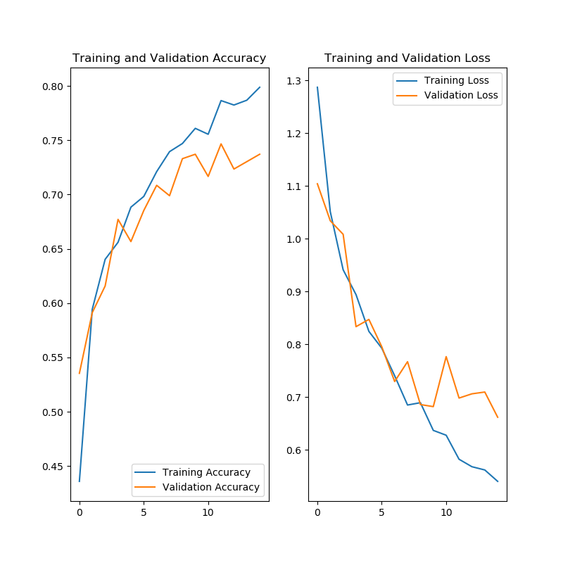

## Tensorflow 이용한 이미지 분류

### 진행 상황
PROGRESS.md 참고

### 참고 링크
구글 텐서플로우 이미지 분류 가이드: https://www.tensorflow.org/tutorials/images/classification?hl=ko

### 문제점
- epoch 2부터 학습이 되지 않음 (accuracy와 loss가 그대로임) (태준님 도움으로 해결!)
- 과적합 문제 (구글 가이드를 보고 해결)
- 훈련 후 새로운 해바라기 사진을 넣었을 때 confidence가 39.83%밖에 되지 않음 (해결. softmax를 두 번 적용했었음..)